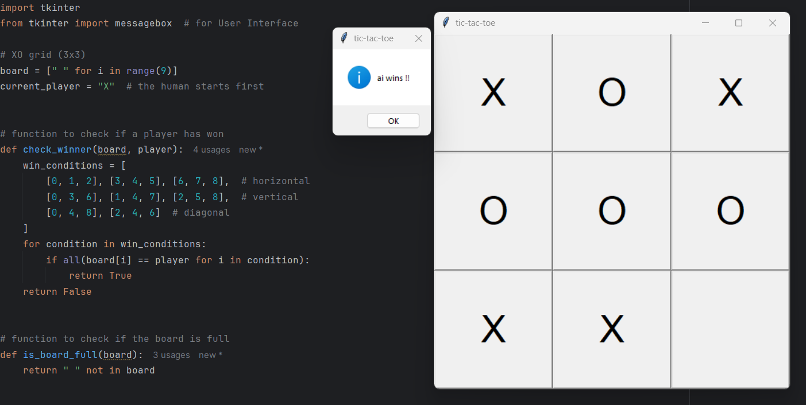

# Tic-Tac-Toe with Minimax AI

This is a simple **Tic-Tac-Toe game** in Python with a **GUI using Tkinter**.
The human plays as **X**, and the AI plays as **O** using the **Minimax algorithm**, making it unbeatable.

---

## Screenshot

## How to Run
1. Run the `tic_tac_toe.py` file
2. Click on a cell to play as **X**. The AI will make its move automatically.
