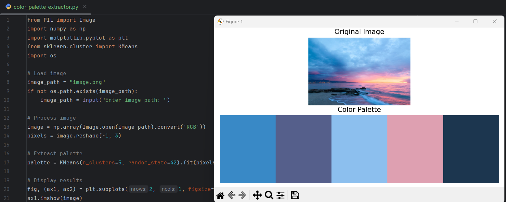

# Color Palette Extractor with K-Means

This project uses **K-Means clustering** to extract the **main color palette** from an image.

* **Input:** Any image file (PNG, JPG, etc.)
* **Output:** Displays the original image and the extracted **5-color palette**.
* Built with **Python**, **Pillow (PIL)**, **NumPy**, **Matplotlib**, and **Scikit-Learn**.

---

## Screenshot

## How to Run
1. Install required packages :

   pip install pillow numpy matplotlib scikit-learn

2. Place your image in the folder or provide a path when prompted.
3. Run the script:
