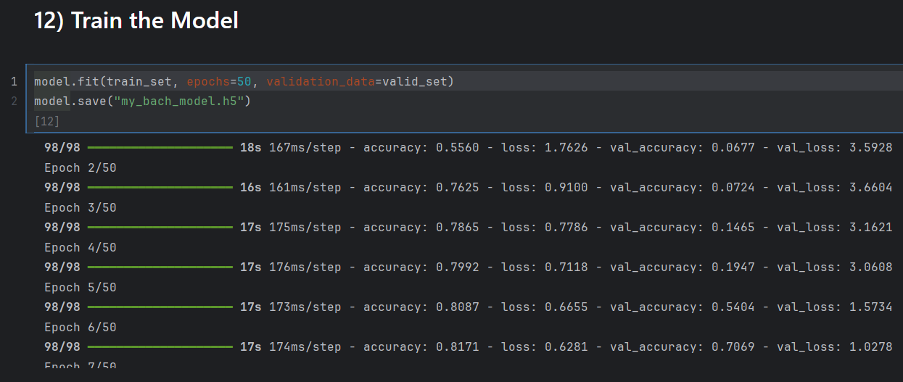
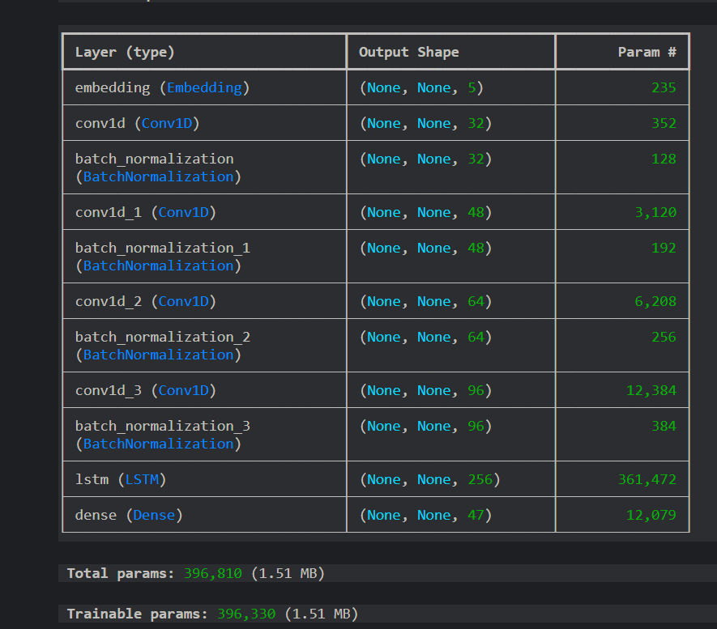
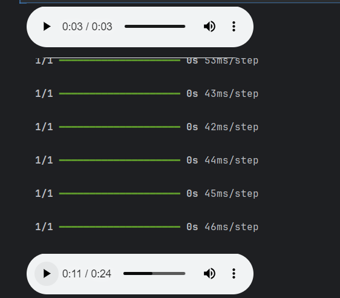

# Music Generator

## Overview
This project is a Bach music generator that uses deep learning to create chorales in the style of Bach.  
It allows users to generate music without needing to know how to play instruments or compose music.

The purpose of this project is to explore how deep learning can be applied to creative tasks like music generation.  
It demonstrates sequence modeling, preprocessing of structured musical data, and neural network design for generative tasks.

---

## Features
- Automatic dataset download and extraction
- Preprocessing of chorales into sequences of notes
- Deep learning model using Embedding, Conv1D, and LSTM layers
- Audio playback of generated music (works locally)
- Generation of new chorales from seed notes

---

## How It Looks

### Model Training


### Model Architecture


### Generated Music Preview


> Note: Audio playback works locally via the `play_chords()` function.  
> GitHub cannot render audio directly.

---

## How to Run

1. **Clone the repository:**
```bash
git clone https://github.com/maryamkanj/ai-ml-course-projects.git
cd 07-Music-Generation
