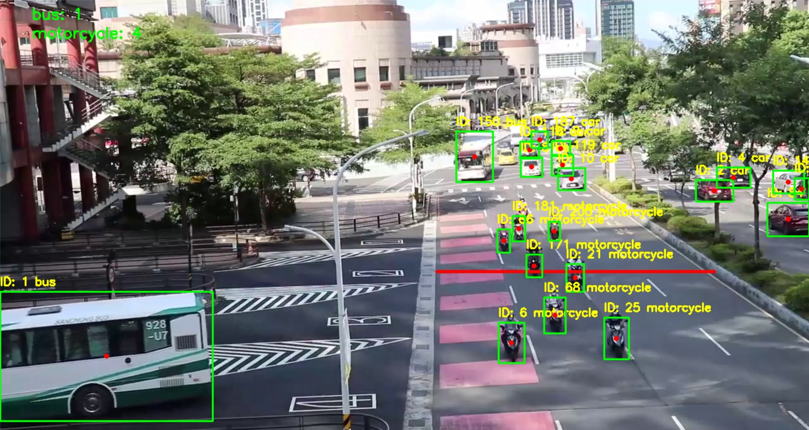

# YOLO Object Detection, Tracking & Counting

This project demonstrates **real-time object detection, tracking, and counting** using **Ultralytics YOLO** and **OpenCV**. Each detected object is assigned a persistent ID and counted exactly once when its center crosses a predefined virtual line in the frame.

---

## 🔹 Key Features

*   **Advanced Detection:** Utilizes the pretrained YOLO model (`yolo11l.pt`) for high-accuracy multi-class detection.
*   **Persistent Tracking:** Implements object tracking across frames with unique IDs to ensure consistent monitoring and prevent double counting.
*   **Line-Based Counting:** Automatically increments counts per class when an object's center point crosses the red reference line.
*   **Real-Time Visualization:** Draws bounding boxes, tracking paths, and live count overlays directly on the video stream.
*   **Robust Execution:** Features a safe execution loop that gracefully handles the end of video files and releases system resources automatically.

---

## 📸 Sample Result

Below is a demonstration of the tracking and counting system in action:



| Feature | Visual Representation & Logic |
| :--- | :--- |
| **Red Line** | Represents the virtual counting boundary. |
| **Counting Logic** | Objects are registered and counted once upon crossing the boundary. |
| **Visual Feedback** | Bounding boxes, tracking IDs, and class labels provide real-time clarity. |

---

## 📦 Tech Stack

*   **Language:** Python 3.13.1
*   **Framework:** [Ultralytics YOLO](https://github.com/ultralytics/ultralytics)
*   **Computer Vision:** OpenCV (`opencv-python`)
*   **Data Handling:** `collections.defaultdict`
*   **Environment:** Jupyter Notebook or Standard Python Script

---

## 🛠️ Setup Instructions

Follow these steps to configure your environment and run the project:

### 1. Create and Activate a Virtual Environment

**Windows:**
```bash
python -m venv myvenv
myvenv\Scripts\activate
```

**Linux / macOS:**
```bash
python3 -m venv myvenv
source myvenv/bin/activate
```

### 2. Install Dependencies
```bash
pip install ultralytics opencv-python
```

### 3. Run the Project
You can execute the system using either the Python script or the provided notebook:

*   **Python Script:** `python Vehicle_Counting_Tracking.py`
*   **Jupyter Notebook:** Open `Vehicle_Counting_Tracking.ipynb` and run all cells.

> [!TIP]
> Press **'q'** during video playback to exit safely. The script will automatically release the video capture and close all windows.

---

## 📁 Project Structure

```text
08-YOLO-object-detection/
├── assets/
│   └── result.jpeg        # Result screenshot
├── test_videos/
│   └── vid.mp4            # Input video source
├── myvenv/                # Virtual environment
├── Vehicle_Counting_Tracking.ipynb
├── README.md
└── .gitignore
```
